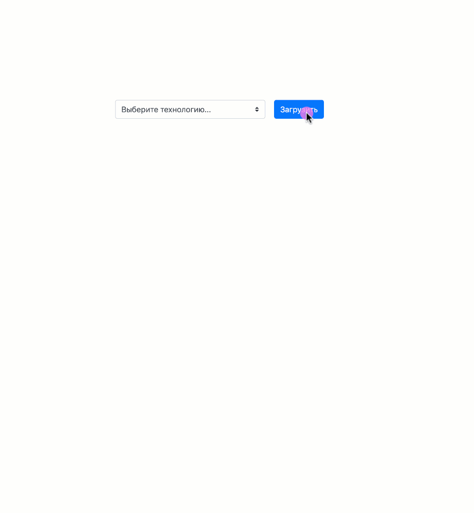
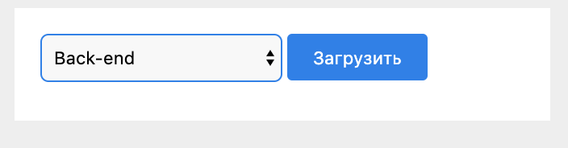
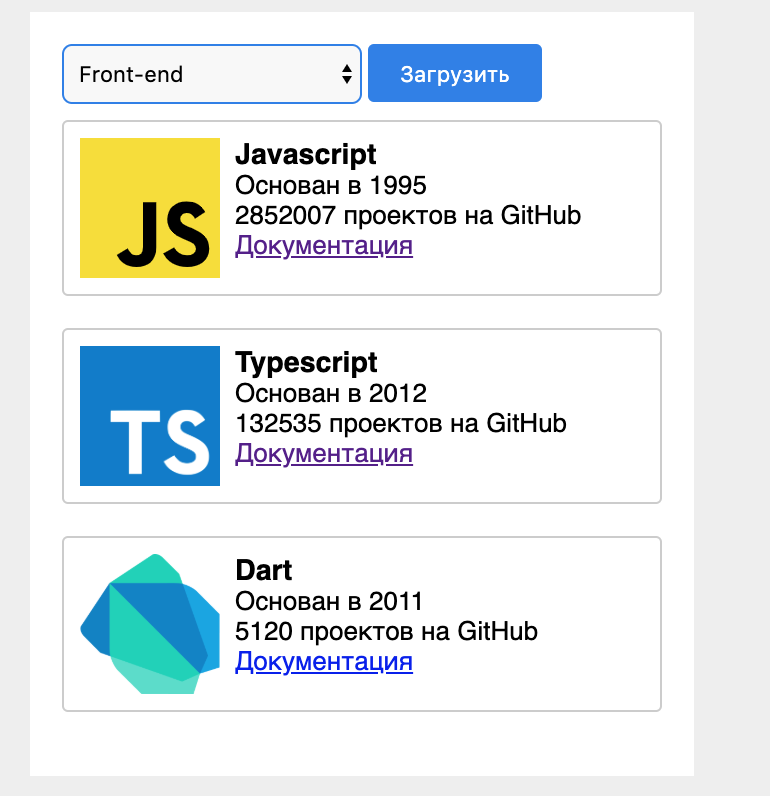

# Задача “Рейтинг языков программирования”
## Описание
   

Подготовить страницу со статистикой по языкам программирования.
На странице должен быть выпадающий список, в котором мы можем выбрать
“Направление разработки” (Front-end, Back-end, Mobile).

Мы можем выбрать только одно направление или оставить поле пустым.

После нажатия на кнопку “Загрузить”, должен быть отправлен GET запрос на сервер по url
https://frontend-test-api.alex93.now.sh/api/languages и передан параметр “group”
с возможными значениями frontend, backend, mobile в зависимости от того, что выбрал пользователь на странице.

Пример запроса для получения данных по backend направлению (можно просто кликнуть по ссылке).
https://frontend-test-api.alex93.now.sh/api/languages?group=backend

Результатом данного запроса будет JSON с данными, которые нужно вывести на страницу.
Пример результата работы программы:

**Вам необходимо отобразить только те языки, у которых есть параметр logo.**

## Требования

* В проекте должны быть файлы index.html с разметкой, index.js с подключаемым кодом и styles.css со стилями
* Можно использовать современные возможности языка, без учета старых браузеров
* При реализации задачи можно использовать внешние библиотеки

## Будут оцениваться

* Структура кода, разделение на логические блоки, читаемость.
* Внешний вид страницы

## Материалы, которые могут пригодиться

* [Работа с DOM](https://learn.javascript.ru/document)
* [Работа с событиями](https://learn.javascript.ru/introduction-browser-events)
* [Получение данных с сервера](https://learn.javascript.ru/fetch)

